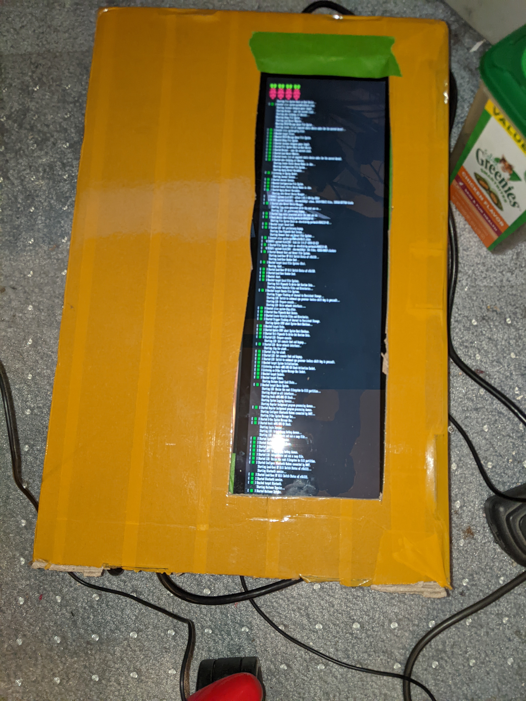
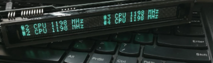

# Retro Themed Wall Mounted Chores List Lab Notes

*Sunday, June 26, 2022 10:35 AM*

Keywords: Task List, To Do List, Magnetic, Magnet, Wall Mounted, Adult Activity Center, Electromagnetic, Toggle Switch,
Chores

# Adult Activity Center Chores List

We describe a device that acts as a simple to do list or list of chores. It is a display showing which chore needs to be
done, along with a number of physical buttons to interact with.

We build a device that has a number of narrow LED screens. Or possibly one large LED screen. These LED screens display a
task or chore to be completed.

Next to each task to be completed is a physical button that clicks. It has a very satisfying click. The button can
either be manually toggled from one position to the other, or
software can automatically toggle the button from one position to the other. The buttons can also change colour, at the
very least appear either red in the untoggled state and green in the toggled state.

The device runs a simple website that lets you program a list of individual tasks or chores, and when these tasks should
be reset, both on time of day and day of week. E.g.Button 1 says "Water Rosemary" and reset at 6AM every Friday. Button
1 says "Water Rosemary" and reset at 6AM every
Monday."

This device gives you a list of tasks or chores that you need to do, and a physical interaction with the device when you
complete the task.

# Toggle Switches

A brief internet search does not reveal any off the shelf rocker or toggle switch that fits my criteria of being
controllable via software. That is, you cannot change the physical switching state via software. I will dig a little
deeper. Maybe I am not using the proper search terms.

Update on toggle switches: I found some very expensive electromagnetic toggle switches made by Honeywell, in the
multiple thousands of dollars range, that are used in aircraft, so these are out of the question. But I also found a
youtube video on the A10 warthog flight simulator project that demonstrates how to convert regular toggle switches in to
cheap electromagnetic switches, and that lead me to FlitePal which makes an off-the-shelf solution for around $60. I
purchased the only one they had in stock, and will check it out, and probably order another dozen or so when I can.

Update: Omron has some rocker switches that are controllable. It would be trivial to 3D print a replacement toggle in
resin that fits that rocker switch.

# LCD Screen

I've decided at this point that a long, narrow screen would be ideal. The screen may or may not be touch screen. I am
looking at somewhere between 14" and 24" in length, and around 4" to 5" wide.

# Computer

The entire system is driven by an SBC, probably a Raspberry Pi, that runs Linux from an SD-card. The Raspberry Pi drives
a number of coloured LEDs to indicate task status, and can also drive the electromagnetic toggle switches too. We need
to come up with some way to have about a dozen toggle switches act as inputs, and a dozen electromagnets act as outputs,
and also have a way to switch about two dozen LEDs, and drive an LCD screen via HDMI.

# Power Supply

A single computer
PSU, rated around 100watts, with 12v and 5v rails would be ideal. The 5V rail supplies the SBC and the LED driver
boards, the 12v rail drives the electromagnets in the switches, and we will need to look into what the LCD and driver
board requires, which is probably between 5v and 24vdc.

# Cooling

A couple of small fans blow air across everything to keep the entire thing cooled. Runs on the 5v supply from the PSU.

# LED indicators

We have around two dozen LED indicators. Maybe less. Maybe more. An indicator is either red for task not complete or
green for task complete. You can buy a strand of 25 LEDs that are individually addressable for about $40.

(https://www.adafruit.com/product/322)

# User Experience

A user connects to the web server running on the activity center using their computer or smartphone, and through a
simple task interface, edits, adds or removes tasks/chores to be done.

The kind of tasks that it tracks are simple ones such as "empty the trash cans" or"move the laundry along" or "water the
plants." Chores you know you need to do on a regular basis to act as a functional adult, but may procrastinate on due to
ADD/ADHD or "just don't wanna/just don't feel like it."

Tasks can be set up to be one shots on a particular date, though generally the activity center isn't for that. Tasks can
be set up to repeat every day, e.g. water the basil, with a window of time when they need to be addressed, e.g. 9AM
every morning. Tasks can be set up to repeat every X days or every Tuesday (because Tuesday is trash collection day) or
every N days (water the rosemary every four days). Tasks are the automatic reminder to do something, a visual indicator
that it has or has not been done, and a small nagging reminder "that you really need to take care of that."

When a task needs to be done it is placed in an empty task slot on the activity center, the indicator light is changed
to red to indicate that the task has not been completed, the toggle switch is set to the off position, and then task
waits to be completed. A user walks past the activity center, takes care of the task that needs to be done, and then
flips the toggle switch to the on position. The electromagnet in the toggle switch holds the switch in place, the
indicator light switches to green, the task display changes to indicate the task is done.

The activity center then waits a predetermined amount of time, 15 minutes or an hour, or an entire day, and then resets
the toggle switch to the off position, changes the indicator light from green to red, and resets the task to be done
again.

# Prototype

Initially the task list can be a simple JSON file or text file that just gets loaded up.

# Screen Size

I have debated back and forth on the screen size, and I think a 14" 4k one-third screen will be more than adequate.
There is such a screen on Aliexpress, that has capacitive touch, for around $170 with the driver boards.

(https://www.aliexpress.com/item/3256802883867574.html?spm=a2g0o.productlist.0.0.217a6256zG0FR4)

# Single Board Computer

I can either use a Raspberry Pi (and older model will work fine) that can display a GUI on the main display, and run a
web server on the backend. Or I can use an Nvidia Jetson NX, which does everything I could possibly want, and also gives
me the ability to do CV/ML on the device, such as voice control, taking pictures of things, real-time transcription,
etc.

# Hardware Interfacing

I am
going to use a buffered IO board to connect the SBC to the hardware so nothing
gets fried whilst I am prototyping. I've got two of the buffered IO boards
coming in for experimentation.

# Software

## Showing The Tasks & Chores

We have a dedicated graphical application that writes directly to the VRAM. No desktop environment required. It works
like a dedicated game console in that regard.

(https://www.instructables.com/Raspberry-Pi-Wall-Display-Without-X-Windows/)

(https://medium.com/@avik.das/writing-gui-applications-on-the-raspberry-pi-without-a-desktop-environment-8f8f840d9867)

I'd like to steer clear of using a desktop environment or having to start an X desktop to display anything. There are a
number of ways we can do this. I am thinking something like raylib, or SDL or a game engine that doesn't require a
desktop environment. We might even be able to use Unity3D.

# System Time

The SBC can either use a realtime clock, or connect via WiFi to sync system time with a time server.

# Configuring

You can SSH to the unit.

# Network

The SBC connects via WiFi to our home router, it lets you ssh into the device, and lets the device sync system time.

# Tasks & Chores Setup

We have a simple web server running that lets me define tasks. Or I can load them up from a JSON file. The chores won't
change all that often.

# Example JSON

```
{
    chore: {
        task: "Water plants (except Rosemary)",// occurs every day in the morning
    },
    chore: {
        task: "Water Basil plants",
        periods: ["evening"] // occurs every day in the evening
    },
    chore: {
        task: "Water rosemary",
        weekly: ["Wednesday", "Friday"],
        Periods: ["morning"]
    },
    chore: {
        task: "Empty dishwasher",
        weekly: ["Monday", "Tuesday", "Wednesday", "Thursday", "Friday", "Saturday", "Sunday"],
        Periods: ["morning"]
    },
    chore: {
        task: "Load dishwasher",
        weekly: ["Monday", "Tuesday","Wednesday", "Thursday", "Friday","Saturday", "Sunday"],
        Periods: ["evening"]
    },
    chore: {
        task: "Take out recycling",
        weekly: ["Tuesday"],
        Periods: ["morning"]
    },
    chore: {
        task: "Take out rubbish bags",
        weekly: ["Tuesday"], // reoccurs every Tuesday morning
        Periods: ["morning"]
    },
    chore: {
        task: "Clean cat litter",
        weekly: ["Monday, Wednesday, Friday"], // reoccurs every Monday, Wednesday & friday
        Periods: ["morning"]
    },
    chore: {
        task: "Give dog flea medication",
        monthly: "15", // reoccurs on the 15th of each month in the morning
    },
    chore: {
        task: "Wash car",
        monthly: ["10", "20"] // reoccurs on the 10th and 20th of each month in the morning
    },
    chore: {
        task: "Renew CostCo membership",
        yearly: "11/15" // reoccurs once a year, on november 15th, in the morning
    },
    chore: {
        task: "Call your mother",
        yearly: ["12/24", "11/24","9/11","8/11", "7/4", "3/2", "1/2"] // reoccurs once a year, on the specified dates in the year
    },
    chore: {
        task: "Bathe dog",
        monthly: "first Tuesday" // bathe the dog on the first Tuesday of each month
    },
    chore: {
        task: "Browse flea market",
        monthly: ["second sunday", "last sunday"] // browse the flea market on the second Sunday of each month and the last Sunday of each month
    },
    chore: {
        task: "Pay gas bill",
        monthly: "10" // pay the gas bill on the 10th of each month
    },
    chore: {
        task: "Pay car insurance",
        monthly: "12" // pay the auto insurance on the 12th of each month
    },
}
```

|           |                                            |
|-----------|--------------------------------------------|
| "Weekly"  | "Occur on these specific days of the week" |
| "Monthly" | "Occur on this specific day of the month"  |
| "Yearly"  | "Occur on this specific day of the year"   |

What word do we want to use, and how do we define, "every second Tuesday"

Maybe our text file should look like a crontab file instead. But with less accuracy.

No explicit days, yearly, monthly means that it occurs every day.

No explicit periods, means it is due in the morning without any urgency. If you don't give it days, it occurs every day.

We need a way to skip a chore, because the chore does not apply, e.g. you already did it ahead of time, or it doesn't
need to be done due to a changed circumstance.

When the script reads the task file, for each task in the file, the script creates a task which is populated with a
blank name, a morning period, and every day selected. Then if the task definition in the task file has a daily, weekly,
monthly or yearly specification, then those override the default, and if the period of day is defined, then that
overrides the default morning period.

To undo a chore, for example you accidentally indicate a chore is completed because you brushed up against the device,
or you pressed the wrong button, you simply shift the button back to the off/incomplete position. There is enough time
between completing a chore and it automatically resetting, an hour or so, that it won't matter.

# Toggle switches vs rocker switches

We can buy cheap rocker switches, about $20 each, that have the auto-off functionality. We could 3D a post that replaces
the rocker portion with a toggle switch portion. That would bring our costs down, and potentially increase our
reliability.

# Toggle switches

I will wait for the magnetic toggle switch to show up, and verify it works, and if all is good, I will order another 25.
That will be two task devices with 12 toggle switches each, and two spare toggle switches. I will see if the vendor will
give me a discount for 25 of them.

# Build Cost

Currently the build cost is going to run me around $1,300 per device. $720 for toggle switches, and $180 for the screen,
and $200 for the SBC, and then probably $200+ for wiring, proto board, LEDs, power supply and other components. I will
endeavour to get cheaper switches, which will bring that sub-module down to under $200.

# SBC

I have settled on the Raspberry Pi 4 for the time being, to make development easier, and because it can drive a 4K
screen. However, I can probably get away with a Raspberry Pi 2 or 3, if I set the proper configuration to drive a 4K
screen, but it will drive the 4K screen at 15hz or 30hz, which is fine by me. It might well be that the 4K screen can
only run at 30hz anyway. I won't know until I take delivery of it. I can also develop on the lower end and cheaper
Raspberry Pi in case I blow something up, and once it is all working, I can make use of the higher end model. I won't
need to run at 4K at the start.

# Circuitry

The build should be reasonably easy. It will consist of an SBC and 4K HDMI LCD. The LCD is touch sensitive so it will
send input back to the SBC via USB. There will be a number of electromagnetic toggle switches or rocker switches hooked
up to an I2C GPIO expander. The toggle switches will receive 5v from the PSU with a pulldown to common ground (I think
that's right). The electromagnetic control will receive 12v from the PSU. There will be a number of RGB LEDs that are
controlled via I2C and powered by the 5V PSU. The LEDs are controlled by an I2C breakout board that is driven by the SBC
to set the colour and state of the LEDs.

# Graphics

We use a graphics library like raylib to display imagery and sprites. We create a nice UI for the display, and find
someone on Fiverr to create images and animations for me.

# Alternative Display

We could use old VFD displays for a seriously retro look. That would cost around $1,000 for a dozen displays. And of
course, the toggle switches will add another $720.

(https://www.instructables.com/Feature-Rich-Nagios-Clock/)

If you go this route you will want a clock generator circuit, and then an I2C to GPIO

# Single Board Computer Choice

I have been thinking of running a Raspberry Pi 4 because it can output dual 4K over HDMI. But I have in my possession
five separate Nvidia NX boards. Though three of them don't technically belong to me and will need to be returned
eventually. I have three with carrier boards and two without. The two without carrier boards are not mine, so I
definitely won't be using those. One of the ones with a carrier board doesn't belong to me, so that goes back when they
ask for it. Carrier boards are around $200, which is quite a bit more than a Raspberry Pi 4. But still… It is an nvidia
NX. Which means we could do a lot more with the SBC than a simple Raspberry Pi. We could do voice recognition and
computer vision and a whole bunch of other stuff too. We effectively have two bare SOMs, so we would also need a couple
of heat sinks, which will run about $25 each. These are much older jetsons from years ago for a different project.

It looks like that the bare SOM in the anti-static bag is a TX2 NX module with 16GB and those go on eBay for around
$277.

The TX2 appears to be a lower power board, 1.3 TFLOPS as opposed to 6 TFLOPS. 256 CUDA cores, and no tensor cores. Dual
core CPU as opposed to 6 core CPU. That's fine, it means the carrier boards are cheaper, and I can deploy the TX2 into
either the task list or the jukebox.

I have two TX2 boards. I will need to look up part numbers on the boards and then investigate online. Depending on these
old TX2 boards then I am not going to hesitate to use them in the jukebox and the task list. They will do everything I
need.

Taking apart an old jetson I bought for my Master's studies I located a 512GB SSD on the back, so that's a bonus. That
could be used in either the task list or the jukebox.

# Flitepal switch

Still waiting on delivery of this item. Studying the pictures, and pondering what I already know about a viable solution
I suspect this is a small electromagnet controlled by a MOSFET. 5v performs the MOSFET switching, and 12v is the
switched current to activate the electromagnet. It is possible that the 12v is stepped down by a resistor before or
after the MOSFET so that the electromagnet works on 7v or 9v so as to not be too strong. A spring returns the toggle
switch to its correct position when the elctromagnet releases it. And it is housed in a small plastic or metal case.

My thought is that we could easily recreate this device using our own electronics, and a 3D printed case. When the
device arrives I will inspect it and probably take it apart.

I wonder if there is a purely electronic electromagnet?

The other option is to use a push pull solenoid that literally flips the toggle switch back and forth on demand. The
toggle switch isn't held in place via electromagnet. It is held in place by mechanical force of a spring or the usual
mechanism, but the toggle switch has a longer rod that can be manipulated by way of a solenoid.

This guy made an electromagnet (a week one) on a board

(https://www.instructables.com/Moving-Things-With-Printed-Circuit-Boards/)

These planar inductors could work as PCB magnets

(https://standexelectronics.com/products/planar-magnetics/)

(https://flexar.io/)

This is a 12-layer PCB electromagnet

(https://flexar.io/store/p/pcb-actuator-12-layer)

Would it be powerful enough to flip a toggle switch? Or hold a toggle switch in position?

# Adafruit Delivery

All the parts from adafruit arrived.

# Touchscreen arrived

Touchscreen was delivered. Set it up. Non-existent instructions. The screen looks fantastic. Full 4K. Very bright and
clear. The touch screen works flawlessly. It also identifies itself correctly as 3840x1100 pixels to Windows 10. So it
isn't just a cropped screen. This is good to know. It makes programming much easier.


# Next Steps

I want to build some graphics for a 3840x1100px screen. I can make these graphics in AI/Photoshop and run them on my
current desktop monitors, and once I am happy with how they look, put them on the 14" screen. I am going to go with the
bright VFD look for now. I will build the initial prototype for displaying graphics in Python or Typescript for now. Get
that working, then port everything to Raylib.

# Build graphics in AI

- [ ] Build a static basic layout in AI that demonstrates what the screen will look like
- [ ] Put the 14" screen in an enclosure where it won't get damaged
- [ ] Hook the 14" screen up to my workstation
- [ ] CVerify what the static basic layout in AI will look like on my screen
- [ ] Install raylib on linux machine
- [ ] Get basic display code up and running on raylib
- [ ] Export AI files to transparent PNGs
- [ ] Get basic static screen up on linux workstation with raylb

# Controlling LEDs

I want to control at least a dozen LEDs. One for each chore. The LED will indicate status. I may have RGB LEDs, or I may
have separate red and green LEDs. That's a lot of LEDs. I am thinking little I2C addressable LEDs on breakout boards. It
drives the price up of the build, but it makes the build quicker to execute. I can always rebuild them on to perfboard
later on.

# Reading switches

We need to read a dozen switches. Dozens of inputs. Dozens of outputs. More than any little SBC should be asked to
handle. We have to read at least a dozen toggle switches, and we probably have several other switches on the device too.
We could read these switches via an arcade controller board. Or we could use a GPIO expander over I2C that will read
them for us. I think the GPIO expander isn't bad option.

I think we are going with a GPIO expander, either the Adafruit or the sparkfun. It seems the simplest option. I need 12
switches, 12 or 24 LEDs, and 12 electromagments, that's between 36 and 48 IO lines.

https://www.sparkfun.com/products/13601

The sparkfun GPIO expander at $7 handles 16 GPIO lines, but it can also generate PWM for dimming LEDs, and also blink
and "breathe" pins at different rates, and it hosts a keypad engine for up 64 button inputs in an 8x8 matrix. And it is
I2C, so two of those boards would permit 16 switch inputs, plus a few other buttons via the keypad engine, 16 output
lines to control the LEDs, dim them, change colour, etc, and then we use a bunch of MOSFET breakout boards

# Controlling electromagnets in switches

Most electromagnets, for our purposes, are going to be between 7v and 9v requirement, just enough to provide resistance
and holding power, not enough to require any kind of strength. The small electromagnets I am thinking of can go up to
12v. Obviously we cannot switch that directly from a raspberry pi which is 5v so we're going to need a MOSFET to do the
swiching for us. 5v controller voltage, 12v (or less) switching voltage. There are MOSFET breakout boards that will do
that for us when prototyping what we need. There is a quad mosfet breakout on amazon for $15, so three of those to
control 12 electromagnets and we are in business. We won't use these in our final build most likely, but for
prototyping, they are ideal.


# Graphic Imagery & Thoughts

I have created a 3840x1100 image in AI. I am currently tinkering around with spacing and sizing of characters. I think
that the currently size of font that I have is a little too large. I can make it somewhat smaller in the horizontal
axis.

Playing around with the spacing between letters, I think that making them too close together is a failure. They need to
space out more.

# Booted the Raspberry Pi

Tried a zero, it booted and sent output to the display, but wouldn't recognize my keyboard all. Need to look in to that.

Then I switched to a Pi3 or it might have been a Pi2, and that booted and let me login via default username & password.
Will need to tweak the display configuration to get full 4K at low frame rate. (30hz? 15hz?)

Once I've got my rpi up and running I need to start installing software.

I am hoping I can develop on the workstation, and then just port the code to the rpi.

If not, I think I will set up a sync between rpi and workstation, and write the code on the workstation and have it sent
directly to the rpi over the network on an automated sync. I can mount a remote share from the synology to the rpi, and
then do the same from workstation to synology, and then edit files on workstation, and just restart the application on
the rpi via ssh. Maybe set it up so it does a watch to do the auto-restart.

# Protecting a delicate screen

I need to get the new 4K screen in to some kind of housing ASAP. It is very delicate. I think a straight up cardboard
box wrapped in tape will work fine for the initial test. I can repurpose the box it shipped in, and use bubble wrap
behind to hold the screen in place, along with some blue tape. Put the power supply in the box with it, then it is a
simple matter of just plugging in to the HDMI of the raspberry Pi. I might even put the Pi in the same box, and just
have a "project box" until I am ready for everything else.

I can wire up the breakout board with the GPIO expander on it, and have that respond to the switches, and also wire up
the I2C LEDs, and have them controlled by the RPI.

# Heatsinks

I am going to need a couple of little heatsinks. And probably a fan to pull air through the box. The heatsinks will be
needed on the Pi and the LVDS display adapter board at the very least.

# Boxed Pi

I have taken the box that the LCD screen shipped in, and cut holes, and taped the screen and display adapter on the
inside, along with a raspberry pi, and the USB-C power adapter to run the screen, and fed the power cables through the
raspberry pi and power adapter.

It looks pretty good for 15 minutes of work. Janky. But good.



# 3D printing

I will need to 3D print a surround for the screen, which will then mount in to the actual case. This will protect the
ever so delicate edges of the screen.

# Touch Screen Unused

I am not sure if the task list is going to have a touch screen, or what use it would be. Perhaps it could be used to
skip a task. Though I'd rather have the physical buttons to do that. If I build the dual screen juke box then I will
probably only order one of the screens with a touch interface, and one screen without, and that way I can re-use this
unused touch screen from the chore list.

# Raspberry Pi Used

I currently have a raspberry Pi 3 Model B in the box. This may be more than what I need, but that's what is installed
for now.

# Raspberry Pi Zero

I note that the raspberry pi zero ran the screen just fine. I don't know if it could do 4K, but it might be worth trying
out. If that is the case, the $10 zero could run the chore list easily enough which means I used one of those up, and
also free up my raspberry pi 3.

# WiFi connection

I am working on getting WiFi working. I have entered the WiFi info but it won't grab a DHCP address.

Fixed! Removing the old wayforward in from /etc/network/interfaces fixed the issue.

# SSH & Login

I have enabled SSH and automatic login for the system.

# Overscan

I fiddled with overscan, I will need to revisit this topic.

# Old Boot Image

The boot image is old, and also from my days at WayForward when this device ran as a build monitor for the CI/CD. It
still had the eayforward WiFi info in it.

# Old Raspberry Pi Image

As this image on the SD is at least three years old, I may want to consider wiping it and doing over.

# Fixed IP

Once I have the WiFI connected I will give it a fixed IP in my asus router so that it will be easy to find.

Update: Done. 10.0.32.90

# Upgrading OS

Upgrading the os with apt upgrade. Let's see how far I can upgrade before I have to consider rebuilding the image.

Jessie is obsolete and the mirrors for the packages were removed. I have followed the guide here
(https://djangocas.dev/blog/upgrade-existing-jessie-to-buster-without-re-image/)

which is letting me upgrade to stretch, and from there I will upgrade to buster.

Update: Have successfully upgrade jessie to stretch. Now upgrading stretch to buster.

Update: Looks like the buster upgrade is complete. Will verify this morning when I get to my desk.

Update: Update Buster to Bullseye. Now on latest raspbian release.

# Magnifying glass

I am having to use a magnifying glass to read the 14" 4k monitor.

I might consider getting an oversized full page magnifier for this. That might also produce a really neat effect for the
final build.

# 4K output

I have set up the screen to do 4K output. 30fps. We shall see how it performs when I get graphics to display

# Heatsinks and fans

I will definitely want a heatsink on each of the major ICs on the display driver and the Raspberry Pi CPU. I will most
likely put a small fan in the case to pull some air through it. The heatsinks don't need to be anything fancy, just an
aluminium heatsink with a sticky pad. Just enough to carry the heat away.

# Experimental GL driver

I tried switching to the experimental GL KMS driver but unfortunately that driver does not recognize the display_rotate
options in /etc/config.txt so instead I have decided for the time being to stick to the default display driver.

# Powering Everything

I want to run the toggle switch electromagnets, the Raspberry Pi, the screen, and everything else from a single PSU. I
want the PSU to be inside the case with only a single cable for power. I can use a variety of breakout boards and other
items to do what I need.

## 12v & 5v supply

(https://www.sparkfun.com/products/15701)


It looks like that PSU supplies 2A which should be more than sufficient for my needs, and if it isn't, we upgrade to a
bigger PSU. I haven't calculated power requirements yet. The toggle switches are a huge unknown.

## Power for the screen

The screen uses USB-C and unfortunately does not have any obvious pins or a header that lets me supply power any other
way. My thought is to try wiring it up with a Molex to USB-C cable.

(https://thepihut.com/products/usb-c-to-4-pin-molex-socket-cable-0-5m)


That looks like it will do what I want. And I suspect I don't even really need the molex except for convenience.
Probably a header on the project circuit board.

## Raspberry Pi

The raspberry Pi can either be powered via USB or a GPIO pin. We pull straight from the 5v rail.

## Fans

5v straight from the PSU. Probably a header on the project circuit board connected to the 5v rail.

## LEDs

5v straight from the PSU. These LEDs are already on little breakout boards so that makes wiring them super easy. And
they already have integrated resistors, so I don't need any voltage dividers.

## Toggle Switches

5v and 12v straight from the PSU. Maybe some fly back diodes. Hmmm. Almost certainly will need to put in fly back
diodes.

# Short HDMI cable

I need a 10" HDMI cable

# On/Off Power Switch

I would like the side of the enclosure to have a physical on/off button that completely kills power to the device.

# Overlay FS

I would like the primary partition to be read only and use overlayfs, and a separate partition that holds any dynamic
data.

# Task List Data

I would like the task list data to be stored on the device, and the device shares a Samba directory without password
that permits anyone on the local network to connect and edit the text file. This means the device needs to reload the
task list at regular intervals or maintain a watch to see if the file has been updated. My thinking actually is that the
task list device can rsync from a remote folder on the NAS using an SSH key and pull down the file to local storage
whenever the remote file changes, and then trigger a restart of the chores list application. Or a reload of the data at
least.

# External USB port

The enclosure has an external USB port that lets you plug in a keyboard, quit the main application and drop to a shell,
where you can edit the WPA supplicant info.

# Clear labelling

The username and password and IP address and MAC address and hostname of device is placed on a label on the back of the
device to make it easy to connect and login. The label also has the samba share path. The label also has instructions on
how to quit the application and drop to the shell.

# Quitting the application

The escape key or space key on the regular USB keyboard should exit the application and put you at a shell or a regular
login prompt.

# Mouse input

I need to figure out how to make the touch screen act as a mouse, and then figure out how to make the mouse be
recognized by pygame or raylib.

Update:Done. That was easy, simply plug the touchscreen into the USB port on the Rpi and pygame automatically sees the
mouse input.

# Mouse Input Scaling

Need to scale the mouse input. Right now it seems to be confined to the top 1/4th of the visual display. I suspect this
is a setting in the pygame mouse settings, or something similar.

This stack overflow post has information on mouse scaling

(https://stackoverflow.com/questions/53085568/how-do-i-get-the-mouse-position-on-a-pygame-scaled-surface)

What I probably should be searching for is "touch screen scaling."

# Mouse Dragging

I either need to find an add-on module or investigate pygame itself, that will permit me to detect someone dragging
their finger across a portion of the display, within an invisible bounding box. Writing the code to do this myself
should be trivial, create a designated bounding box area, detect mouse down event, detect mouse movement event, on mouse
down event start accumulating mouse movement events, determine if the current mouse movement is to the right of the last
mouse position or the start of the mouse down event position, calculate the overall drag distance since the first mouse
down event, detect mouse up event, determine which bounding rectangle the mouse was dragged in. We put invisible
bounding rectangles over each< rank of the vVFD so that individual tasks can be dragged on.

# Finger Detection in pygame

There appears to be finger detection in the pygame 2

(https://stackoverflow.com/questions/40509410/pygame-any-touchscreen)

(https://forums.raspberrypi.com/viewtopic.php?t=89506)

[ code for handling swipes and drags](https://github.com/9and3r/RPI-Info-Screen/blob/master/default.py#L223)

(https://github.com/9and3r/RPI-Info-Screen)

# Touch

screen calibration

Of course, I'm an idiot, the raspberry pi needs to have its touch screen calibrated. Windows 10 figured this out
automatically, but Linux is a slightly different beast that is less forgiving.

(https://forums.raspberrypi.com/viewtopic.php?t=203483)

[This seems to be the most useful resource. It uses ts-calibrate.](https://robu.in/how-to-calibrate-raspberry-pi-touch-screen/)

[This seems to be for X, which we don't want, but I'll figure it out.](https://www.gechic.com/en/raspberry-pi-install-touch-monitor-and-touch-calibrator-driver/)

# Visible Mouse Cursor

I obviously need to turn off the visual aspect of the mouse. I want the input, I don't want the mouse cursor.

# Rate of change in the list of chores

The chores will not change all that often, once the initial list of chores are set up, it will continue to function as a
daily reminder with that list of chores and see very little change over the course of the year. It isn't a general
purpose task list or calendar reminder.

# SSH

Copied my ssh keys over to the raspberry pi to make login a little easier.

# SSHFS

Instead of using an SMB share for development, maybe I can just simply use sshfs. Easier to setup.

# SSH from linux and windows

Copy my public key from linux and windows to rpi

# SDL2 & Pygame

Tried out SDL2 & Pygame on rpi and it worked out of the box. I'm going with that.

# /dev/fb1

Today I learned that /dev/fb0 (frame buffer 0) is the HDMI output of the rpi, and /dev/fb1 is the LCD over GPIO.

# First light

Got pygame to initialize the display and draw a red background. Got an image to load.

# Workstation & Rpi code

Got my code to work on both the workstation and the rpi.

# Slow pygame initialization

The initialization of the screen on the rpi is very slow. Need to investigate.

# Mouse pointer

I hooked up the USB of the touchscreen to the rpi, and it now moves the mouse pointer around. I have a visible pointer
on-screen. The touch screen seems to not be scaling to the display at this time, I will need to address that.

# Overheating icon

I was getting an overheating icon flashing on the screen. I am not sure if that was the pi or the video driver board.

# A temporary fan

I installed a noctua fan, powered by the raspberry pi USB power, into the box, to keep the electronics cool.

# Art tests

Tried varying layouts of the VFD graphics. Still tweaking these. I started with some very cramped letters layout, 21+
characters across, 20+ lines tall. I am now at 21 characters across and 17 lines tall. I am thinking of going down to 20
characters across and 12 lines tall.

# Cat litter task

I created an image that says "clean downstairs cat litter" that is quite readable on the display.

# JSON newlines

I have realised I may want to put in the ability to have a newline character in a JSON string for the task description
that will be interpreted by the text renderer.

# Background image layout

Right now I am just using a gigantic single image for the background. I think I will most likely switch to just a single
image for the switched off VFD section and lay it out with code. Not to save space, but to make my life easier. Have
font line heights, etc.

# Font

I am playing with the idea of having a separate images for each letter, number, character, etc. Alternatively I can
construct the characters from individual segment elements, and then introduce a little jitter into the placement of each
element, so that they look more organic.

# Studying a VFD

I need to sit down with a VFD and study it to determine if there are things like traces, etc, that are visible.

# Touch screen overlay

The black border around the touch screen is quite thick and slightly overlays the display area. I may not want to use
the overscan region of the display, or ensure my graphics fit within the black border of the touch screen.

# Chores

|                                    |                               |                           |    |    |
|------------------------------------|-------------------------------|---------------------------|----|----|
| clean downstairs litter            |                               | Monday, Wednesday, Friday |    |    |
| Clean upstairs litter              |                               | Monday, Wednesday, Friday |    |    |
| Take out recycling bag             |                               |                           |    |    |
| Take out rubbish  bag              |                               |                           |    |    |
| Pay health  insurance              |                               |                           |    |    |
| Give dog  medication               |                               |                           |    |    |
| Refill dry cat  food               |                               |                           |    |    |
| Refill dry dog  food               |                               |                           |    |    |
| Clean coffee  machine              |                               |                           |    |    |
| Wash kitchen  counters             |                               |                           |    |    |
| Replace blue  sponge               |                               |                           |    |    |
| Deep clean coffee  machine         |                               |                           |    |    |
| Deep clean  dishwasher             |                               |                           |    |    |
| Deep clean washing  machine        |                               |                           |    |    |
| Clean refrigerator  shelves        |                               |                           |    |    |
| Launder dining  room curtains      |                               |                           |    |    |
| Launder breakfast  nook curtains   |                               |                           |    |    |
| Launder living  room curtains      |                               |                           |    |    |
| Launder office  curtains           |                               |                           |    |    |
| Clean upstairs  toilet bowl        |                               |                           |    |    |
| Clean downstairs  toilet bowl      |                               |                           |    |    |
| Clean upstairs  bathroom mirror    |                               |                           |    |    |
| Clean upstairs  bathroom sink      |                               |                           |    |    |
| Clean upstairs  bathroom floor     |                               |                           |    |    |
| Wash downstairs  bathroom mirror   |                               |                           |    |    |
| Vacuum wooden  stairs              |                               |                           |    |    |
| Wash downstairs  bathroom floor    |                               |                           |    |    |
| Wash downstairs  bathroom sink     |                               |                           |    |    |
| Replace kitchen  towels            |                               |                           |    |    |
| Clean around                       |                               |                           |    |    |
| kitchen stove                      |                               |                           |    |    |
| Clean countertop oven              |                               |                           |    |    |
| Launder drying mats                |                               |                           |    |    |
| Call for refill of pet medication  |                               |                           |    |    |
| Refill medications & supplements   |                               |                           |    |    |
| Replace batteries in flashlights   |                               |                           |    |    |
| Blow dust out of Synology          |                               |                           |    |    |
| Blow dust out of farms             |                               |                           |    |    |
| Blow dust out of workstation       |                               |                           |    |    |
| Vacuum under Justin's desk         |                               |                           |    |    |
| Switch out blue sponges            |                               |                           |    |    |
| Switch out green sponges           |                               |                           |    |    |
| Deep clean garbage disposal        |                               |                           |    |    |
| Sharpen kitchen knives             |                               |                           |    |    |

# Urgency

I went looking for a word that fulfills the requirement of specfing a day part that can be used for urgency of task.
Couldn't find anything.

I can specify urgency of the chore within the JSON but defauilt urgency should be sane. A chore that has a daily
requirement should default to "immediate"urgency, and immediate meaning "do this in the next few hours." A chore that
has a weekly reqirement should default to a "day" urgency, meaning "take care of this sometime in the next 24 to 48
hours." A chore that has a monthly requirement should default to a "week"urgency, meaning "take care of this when you
can, sometime in the next week is fine." And a chore that occurs yearly should default to amonth" urgency, meaning "any
time in the next 30-ish days is fine."

What we want to be careful of is chores we are not addressing stacking up on the display list and not being com pleted,
leaving no room for more urgent chores to be done.

# Font created

Have created a basic VFD font, upper case and lower-case, numbers and some symbols.

# Code updated to build the screen

Have implemented functionality that will construct the screen from individual images as opoosed to using a single large
image to test out the display.

# Posted on LinkedIn & Reddit

Quiclk posts on linkedin and reddit showing off progress and giving a brief status update.

# Spaced out the lines

Gave more vertical space between each line of text. Still not happy with this. Cannot space out horizontally as I start
losing the capability to display a long string.

# Two lines of text

Switched to using two lines of text per chore. 24 lines total. 18 characters wide per line. I think this will be more
than adequate for my needs.

# Simple text processor

Created a very simple set of functions for processing the text that will be the chores.

# Reddit post was removed

"!iT dOesN'T mEEt oUr STanDaRdS!" Fuck 'em. Fuck reddit mods and their low-effort response to evertyhing.

# Raspbbery Pi & Ubuntu workstation compatible

Made the pygame code and graphics work on both rpi and workstation by scaling the images as they load. I will be able to
get quite far by not having to develop directly on the rpi all the time.

# Separated everything in to functions

# Centering images

# Commas and apostrophes

# Changing colour of font for status indicator

# Adding optional status indicators to the VFD

# Making everything glow and pulse

# Wood grain

# Plywood & Aluminium

# VFD Brightness

Many VFD's have a brightness control on each element. Some of the modern ones that you can buy on Aliexpress offer eight
levels. I would like to build that functionality into my display simulator.

# VFDs under glass

Because the display elements are placed under a glass panel, they appear further away than LCD display elements right at
the surface. The glass touch screen I have helps with that, and I think another layer of optically pure glass may also
help with the effect.

# Custom VFD display manufacturer

I am not going to pursue having a custom VFD designed, but interestingly there is a custom VFD and custom display
manufacturer by the name of IEE over on Kester Avenue in Van Nuys.

# VFDs on Aliexpress

[Lots of VFDs, including the ones I like.](https://www.aliexpress.com/item/3256802561918533.html)




With a programming utility

Runs over USB

(https://www.aliexpress.com/item/3256802715817026.html)

# Mirrored displays

There is a seller with a mini OLED display that works as a VU gauge in a metal case. Interestingly they put a prisim
cube on top and achieve this holographic look


I wonder if we could build something like that, but with a bigger screen.

If we had multiple prism displays stacked one in front of the other, we could put multiple separated images up on a 14"
x4.5" screen and they would give you a parallax effect.

# Added more chores

Put in to the chores table above. Seems to be overly large, but these are also things that occur once a month or once a
year.

# Fortnightly option

Thought about adding a "fortnightly" option to the JSON, but I don't think it is worth it. I don't think it would be
used all that much.

# Chore Pending Queue

The chores list is stored in a JSON file that is read on start-up, and possibly re-read at regular intervals. When the
chores JSON data file is read, new chores are added to a chore pending queue which is persisted to disk. Also on
start-up, this chore pending queue is read in and that data populates the chore display array. By doing this, no pending
chores are lost should the system be restarted for any reason.

Chores are taken from the pending queue and moved to the Chore Display Array when there is space available on the Chore
Display Array

# Chore Display Array

The chore display array maintains the chores that are currently being shown on the display. The position of each chore
in the array is fixed for the duration that it exists in the array. It will never move position even through reboots of
the system.

The Chore Display Array is of a fixed size and represents the actual display output of the device.

The chore display array is persisted to permanent storage every time it is updated.

The chore display array will maintain a time stamp of when the chore was added to the array, the state of the chore (
incomplete, needs attention, skipped, complete)and also the time stamp of when the chore was completed or skipped.

# Skipping Chores

When the user skips a chore, it is flagged as being skipped on the Chore Display Array. It will remain on the chore
display array for at least 15 minutes, in case this was an accidental action by the user, during which time the chore
can either becompleted" as normal or the skip action itself can be undone by the user.

Once a chore is skipped, a timestamp of when it was skipped is set in the chore display array, and after a predetermined
amount of time the skipped chore is removed from the chore display array and the chore will not reappear on the pending
chores list until the next designated time for that chore.

A skipped chore will have a special designation, e.g. dimmer display, different colour, a border.

# Chores That Need Attention

A chore that needs attention, i.e. one that is being ignored by the user, will take on a special display property, e.g.
extra bright, pulsing/glowing display, special colour, bordered outline to alert the user that this chore needs to be
addressed.

We might make it so that chores have a time frame, e.g. "water plants" has a time frame of four hours, but "refill
medication" has a time frame of 24 hours, but "pay amex bill" has a time frame of 7 days, andrenew AAA" has a timeframe
of one month.

# Display Layout

I may want to cut the VFD width down from 20 characters wide to 18 characters wide. By doing this I can put a border
around each rank.

# Display, Ranks, Strips, Cells

We have a 14" vertical display that is broken up in to 12 vertical ranks that are spaced evenly apart. Each rank
contains two strips, laid out vertically, that are again spaced evenly apart, and each strip contains 20 cells, laid out
horizontally within the strip, spaced evenly apart, that is used to represent characters on the virtual VFD display.

# Latched Cells

A character in a cell is latched into the cell when it is written. Individual cells can be over-written. I haven't
implemented this yet, but it is what I intend to do.

The reason to latch the cell contents is that we can continually refresh the display to achieve the VFD look & feel of
glowing and pulsing light by animating what are effectively multiple sprites laid on top of each other.

# vVFD API

I have created a small "API" (set of functions) that can clear the entire vVFD (virtual VFD) display, clear a rank,
write a message to a rank, etc.

Once I figure out what else I want the display to be able to do, I will add functions for that, e.g. colour control,
outline borders, etc.

# Punctuation Characters

I was using the regular 14 segment VFD cells to display punctuation such as exclamation, quotes, etc. I have
experimented with putting these special characters as specially designated segments of the vVFD, and defining them in
the character lookup table as such.

I think I need to make the graphic representation of these punctuation characters slightly larger, between 30% and 100%
larger, than they currently are because they are very difficult to see.

# VFD look & feel

I need to add in the glow & pulse of a VFD which I haven't done yet. I also want to add in more
non-interactive/non-controllable elements to the VFD that sell the look & feel that this is a VFD, so I need "anode
wires" on the glass, terminal headers at the edges, vacuum seal "black dots" and so forth.

# Glowing VFD

I am using pygame, with an underpowered computer, and I feel that using shaders is probably going to be overkill to
handle the glow, so I will need to do the glow in Illustrator and then export that as a static effect. My thought is
that I can make the glow as a separate layer in Illustrator, and then the glow gets applied to the characters in
multiple steps. So to draw a cell, we draw the background, then we draw the character, then we draw the glow.

# Chores That Were Not Done

A chore that is not done, that has been on the chore display array for more than a predetermined period of time will
become a chore that needs attention.

# Recently Complete List

We maintain a list of recently completed chores, we do this so that the display continues to show the chore even though
the chore is completed. When a chore is added to the recently completed chores list, it is also time stamped. Chores
that have been recently completed will remain on the display for at least 15 minutes and up to 2 hours. We do this so
that a chore that has been marked as complete can be "undone" for the duration is sits on the chores list. Chores in the
pending queue will always take precedence over the completed list, but a complete chore must always remain on the
display for at least 15 minutes and never less.

# Completing Chores

When a chore is completed, it is moved from the **chore display array to the** recently completed list .

We may nix this idea of a **recently completed list as we probably won't need it.**

# Logging

I don't have any logging framework in place at this time. I need to set up my environment so that Python can write to my
Seq log server.

# Development Environment

I need a better way to transfer art files from my workstation to the Ubuntu VM and the Rpi, and code from the Ubuntu VM
to the Rpi. I am storing my art files in SynologyDrive. I need to configure my Ubuntu VM to sync with the
development/chores directory on my SynologyDrive. I am thinking a build script that will rsync the files from ~
/SynologyDrive/development/chores/assets/*.png to my Ubuntu machine. Or I migrate my development directory on the Ubuntu
VM to my SynologyDrive directory, problem solved. I can then set up apublish" or "distribute" script that will send the
files from the Ubuntu VM to the RPI. I could then run this "publish" script every time I build & run on the Ubuntu VM,
which would rsync the files to the Rpi on a successful build, ssh to the rpi, kill the chores-list process currently
running (if any), and then relaunch the chores-list python script.

# Git

I need to get everything (except the AI file) checked in to Git and a project pushed to github.

# OneNote to markdown

I would like to figure out how to get my lab notes converted automatically from OneNote to markdown, and then pushed to
git as part of the commit workflow. I would also like to figure out how to do that automatically so it isn't a manual
step.

There are a number of plugins available for OneNote to do this. There is also pandoc which permits you to convert a
.docx to markdown. This all seems rather fucking convoluted to me, especially if I want it automated. I think a
mini-side project would be to use python to simply open the onenote page and convert to markdown using a python script.
How hard could it be?!?

(https://www.codeproject.com/Articles/5318953/OneNote-to-Markdown-Using-Python-and-the-Microsoft)

This solution seems to use the office365 api to access online pages, and has manual steps. Not what I want. I want to
read a .one file.

Seems that most of the python onenote extraction solutions you can find online are by people using the office365 api =
the bazar of a million voices all crying out on how to do the easy stuff.

Hah! Asking the wrong question. Python to onenote produces the usual blithering masses. Powershell and onenote produces
scripts for every possible manipulation you can imagine.

(https://stackoverflow.com/questions/53689087/powershell-and-onenote)

(https://gist.github.com/pinecones-sx/d308951ac2e34a488c8a1d20c043c792)

(https://stackoverflow.com/questions/57397334/how-to-search-text-in-onenote-file-with-powershell)

(https://stackoverflow.com/questions/57558772/powershell-script-command-to-export-onenote-page-names-urls-to-json)

(https://stackoverflow.com/questions/69422731/powershell-object-within-object-extract-property-values-and-export-to-csv)

(https://github.com/wightsci/OneNoteUtilitiesGraph)

# Sprite sheets

I should figure out how to make a sprite sheet for pygame and use that sprite sheet tool I purchased to assemble the
sprite sheet on build.

# Character Graphics Lookup Table

For most of the characters that appear on the vVFD I can simply center them in the cell. However, I have a few special
elements that appear at specific locations within a cell on the VF, e.g. the separating colon, or the quote, or the
comma, which will need to have an x & y offset applied. I have set this up in the vVFD API so that images that have an x
& Y offset of zero (both X & Y are zero) are simply centered within the vVFD cell, and images that have either X or Y as
a non-zero value are placed at that offset from the center of the vVFD cell. All images are always first centered within
the vVFD cell, and only then is the offset applied.

# Texture Packer

Using texture packer utility to generate sprite sheets. Can invoke it from CLI. There's a Windows and Linux client so
that works perfectly. Need to create a build and deploy script that will pack the assets.

# Moved the assets

Migrated the source assets from /chores/src/assets to /chores/assets, and kept the /chores/src/assets for the packed
textures.

# Created the github repo

(https://github.com/justinlloyd/retro-chores)

First commits pushed.

# More parts

Hit up All Electronics in Van Nuys for a replacement IEC320 C14 socket for my PB-507. Also bought a few other things.
Picked up some foam pads with sticky backs that I can use to space the enclosure off the wall where it will hang. Also
picked up a variety of toggle switches that I can study for modification. And a bunch of very small toggle switches for
$15 total that I will find a use for, if not in this project, then another project at some point. And then some small
hand tools, cotton swab sticks, and some pre-cut heat shrink.

# Slack!

I could use the retro theme vVFD to make a Slack chat app that just displays DMs and mentions only on a dedicated
screen.
